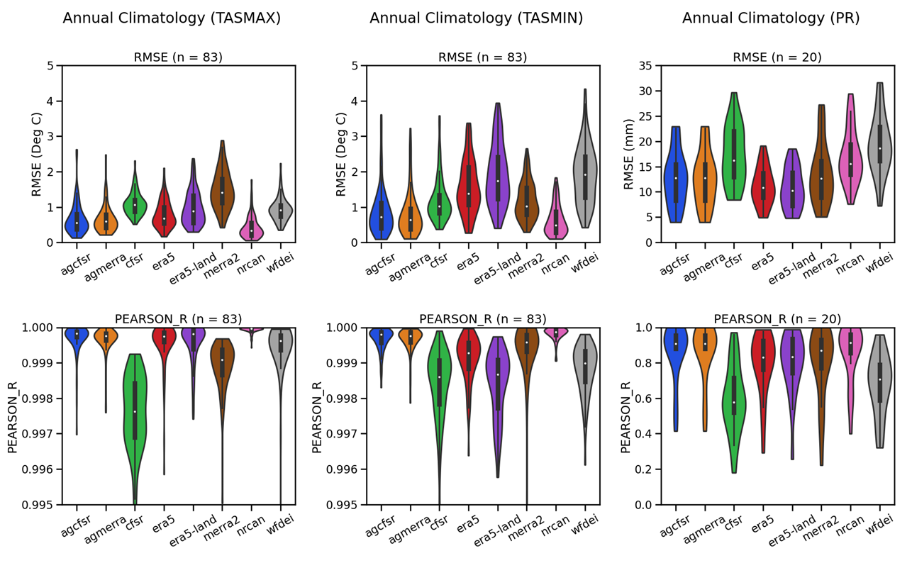
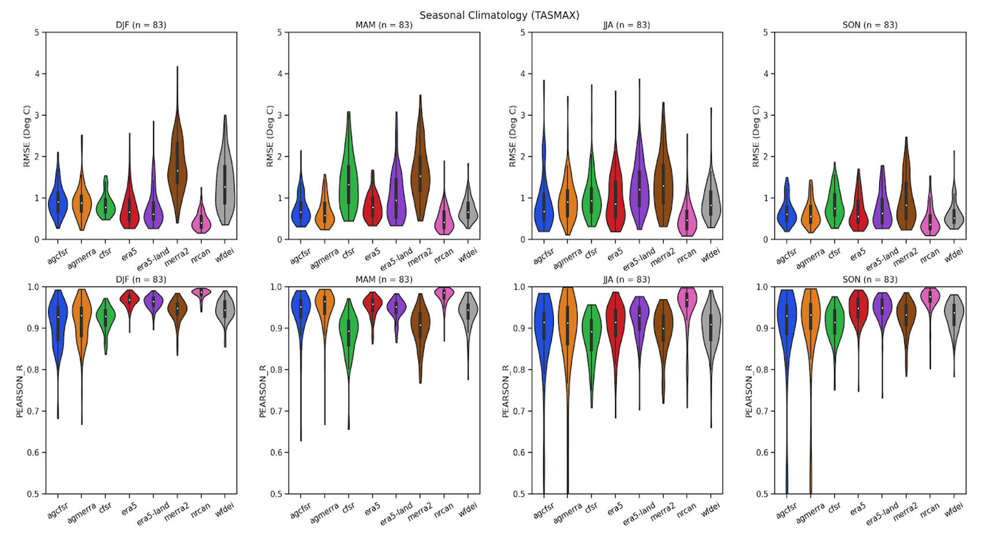
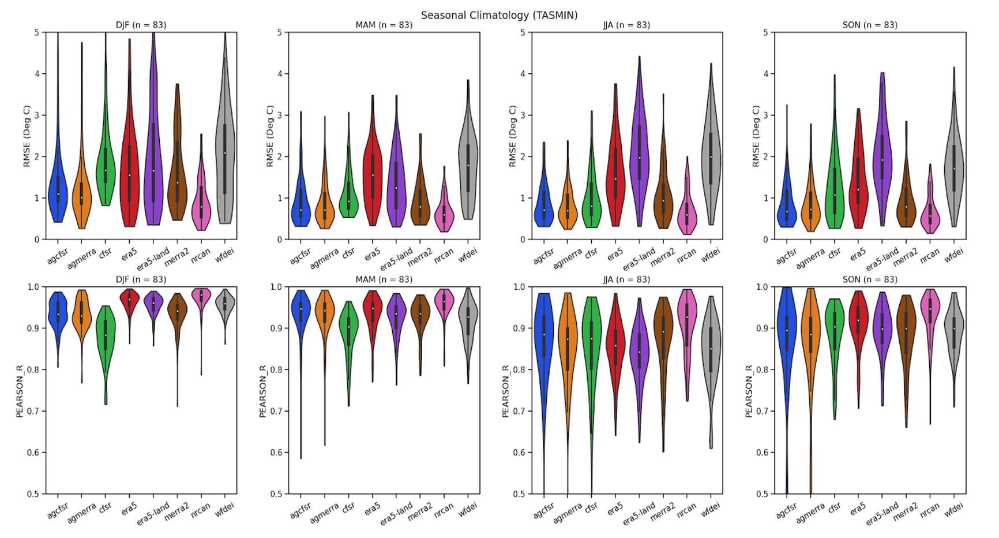
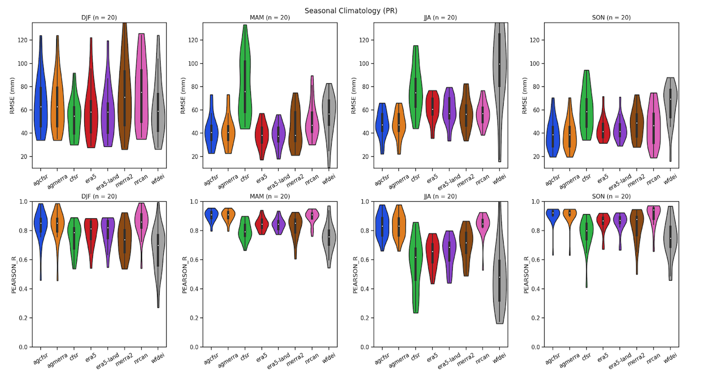
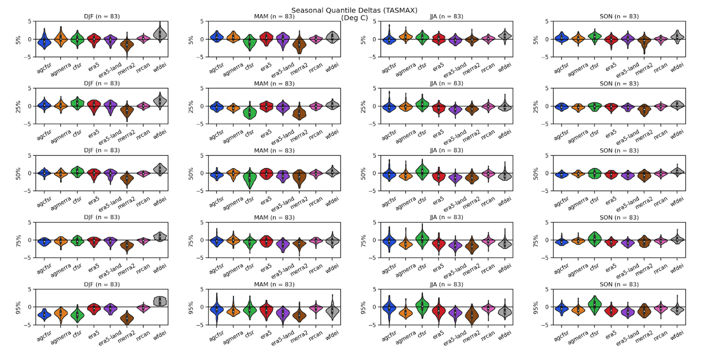
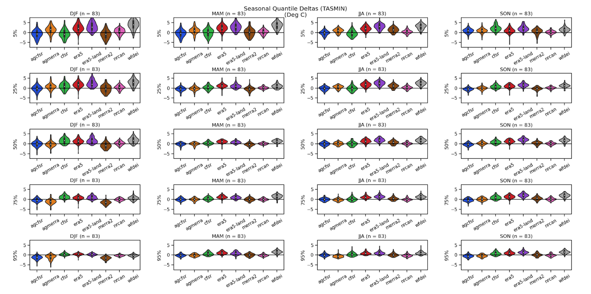
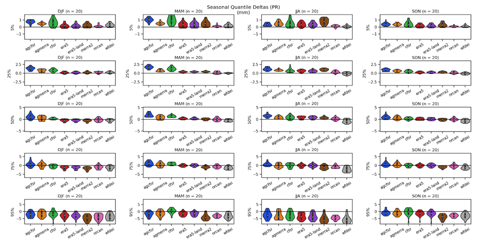

# ESPO-R : Ouranos' Multipurpose Regional Climate Scenarios

## Context
The need to adapt to climate change is present in a growing number of fields, 
leading to an increase in the demand for climate scenarios for often interrelated 
sectors of activity. In order to meet this growing demand and to ensure the 
availability of climate scenarios responding to numerous vulnerability, impact and 
adaptation (VIA) studies, Ouranos is working to create a set of operational 
multipurpose climate scenarios called "Ensemble de Scénarios Polyvalents d'Ouranos” (ESPO)
covering North America at a resolution of 0.1 degree (~9km). This 
operational product actually consists of two related datasets 1) ESPO-R (described 
here) produced from bias-adjusted regional climate simulations, and 2) ESPO-G produced 
following to the same methodology, but from global simulations available via the 
CMIP program.

## Data processing tools
The production and regular update of ESPO-R/G operational datasets represents a challenge
in terms of computational resources. Ouranos has invested a great deal of effort in the
development of powerful tools for this type of data processing via its [xclim software 
package](https://xclim.readthedocs.io/en/stable/).  Built upon the packages xarray and 
dask, xclim benefits from simple to use parallelization and distributed computing tools 
and can be easily deployed on High Performance Computing (HPC) environments.

## ESPO-R5 v1.0
ESPO-R5 v1.0 is an analysis-ready climate projection ensemble based on simulations from different regional climate models (RCM). The full list of simulations that compose the ensemble is shown in the table below. It is mainly based on [CORDEX-NA](https://na-cordex.org/) simulations, with additional runs made by Ouranos with the Canadian Regional Climate Model developed at UQAM. The simulation ensemble covers the period XXXX-YYYY at the daily frequency. It includes the variables X,Y,Z. Mention RCPs included. Simulations are bias-adjusted using the ERA5-Land reference dataset. 

Include simulation Table

### Reference data
ESPO-R5 v1.0 uses the [ERA5-Land reanalysis](https://confluence.ecmwf.int/display/CKB/ERA5-Land)
(Muñoz Sabater, J., 2019 & 2021) as its reference (or target) dataset. ERA5-Land is a re-run
of the land component of the ERA5 climate reanalysis, forced by meteorological fields from 
ERA5 and cover the period 1950 to the 2-3 months before the present. ERA5-Land benefits from numerous 
improvements, making it more accurate for all types of land applications than the original ERA5. In particular, ERA5-Land runs at enhanced resolution (9 km vs 31 km in ERA5).

ERA5-land was retained after an evaluation of multiple candidate datasets (Table 1) against observed data for the 
variables of daily maximum and minimum temperatures, and daily total precipitation for the period 1981-2010.  
Observed data for the comparison consisted of Third Generation of Homogenized Daily Temperature for Canada (Vincent et al. 2020), 
as well as Second Generation of Daily Adjusted Precipitation for Canada (Mékis and Vincent. 2011) (AHCCD). To be included in the 
assessment, adjusted station data had to have 25 years of valid data for the period 1981-2010, a valid year requiring 
each month to have no more than 10% missing data.

The evaluation criteria included: 
1) a comparison of the mean annual cycle (figure 1), 
2) an evaluation of the inter-annual seasonal time series (figurea 2a-c), and 
3) a seasonal evaluation of the quantile bias (5, 25 , 50, 75, 95) of the daily 
values between station data and the various candidates (figures 3a-b). 

Summary results of quantitative comparisons (figures 1 to 3) indicate that there is no clear winner for the choice of 
reference dataset, with results varying by season or criteria. As such, ERA5-Land was chosen because it 
generally shows good results while presenting the advantages of an increased spatial and temporal resolution
as well as a temporal coverage up to the present (Table 1).

**Table 1. Summary of reference dataset candidates for ESPO-R v1.0.**

| Dataset             | Start year | End year    | Spatial coverage       | Spatial resolution | Temporal resolution | Reference                               |
|---------------------|------------|-------------|------------------------|--------------------|---------------------|-----------------------------------------| 
| ERA5                | 1979       | Present     | global                 | ~32 Km             | 1 h                 | Hersbach et al. 2018                    |
| **ERA5-Land**       | **1979**   | **Present** | **global (land only)** | **~9 Km**          | **1 h**             | **Muñoz-Sabater, J. et al. 2019, 2021** |
| NCEP Reanalysis 2   | 1979       | Present     | global                 | 2.5 x 2.5 degrees  | 6 h                 | Kanamitsu et al. 2002                   |
| NCEP CFSR           | 1979       | 2009        | global                 | ~40 Km             | 1 h                 | Saha et al. 2010                        |
| MERRA2              | 1980       | Present     | global                 | ~50 Km             | 3 h                 | Gelaro, et al. 2017                     |
| AgCFSR              | 1979       | 2010        | global (land only)     | ~30 Km             | 1 h                 | Ruane et al. 2015                       |
| AgMERRA             | 1979       | 2010        | global (land only)     | ~30 Km             | 1 h                 | Ruane et al. 2015                       |
| WFDEI-GEM-CaPa      | 1979       | 2016        | global (land only)     | ~10 Km             | 1 h                 | Asong et al. 2020                       |
| NRCAN Gridded v2017 | 1950       | 2017        | Canada (land only)     | ~10 Km             | 1 day               | McKenney et al. 2011                    |

**Figure 1.** Summary of assessment of mean annual cycle (1981-2010) between candidate datasets and adjusted station data for daily maximum temperature (left column), daily minimum temperature (middle column) and total precipitation (right column). The figures represent the distribution of mean square (top) and correlation (bottom) error values between stations and gridded data.

a)

b)

c)

**Figure 2.** Summary of evaluation of interannual seasonal time series (1981-2010) between candidate datasets and AHCCD stations for daily maximum temperature (a), daily minimum temperature (b) and daily total precipitation (c) variables ). The figures represent the distribution of mean square (top) and correlation (bottom) error values between stations and gridded data.

a)

b)

c)

**Figure 3.** Summary of bias by percentile (1981-2010) between candidate datasets for daily values of maximum temperatures (a), minimum temperatures (b) and total precipitation (c). The comparison was made for the seasons of winter (DJF: 1st column), spring (MAM: 2nd column), summer (JJA: 3rd column) and autumn (SON: 4th column). The results for the compared percentiles (5, 25, 50, 75, and 95) are organized by row in ascending order, starting from the top.

### Regional climate simulations
TODO add description of vars and table of simulations

### Methodology
The temperature and precipitation data from the simulations in table 2 were first extracted over an area covering North America and, 
if necessary, converted into daily values. Then using the [ESMF software](https://earthsystemmodeling.org/regrid/), accessed through its python [xESMF](https://xesmf.readthedocs.io/en/latest/) interface, all the extracted simulation data is interpolated 
bilinearly to the ERA5-Land grid.

The ESPO-R5 v.1.0 bias adjustment procedure then uses  [xclim](https://xclim.readthedocs.io/en/stable/sdba.html) algorithms to adjust simulation bias following a quantile mapping 
procedure. In particular, the algorithm used follows the method of "Detrended Quantile Mapping" described by Cannon (2015), but with some modifications. The procedure is bipartite. 
First, the adjustment factors are calculated based on reference data and simulations over a common period (training stage). Then the entire simulation is corrected with these factors (adjustment step). 
The reference period chosen here is 1981-2010. Adjustments are univariate, where corrections are applied separately for each of the 3 variables.
Data is adjusted for each day of the year, using a rolling window of 31 days. For example, the adjustment factors for February 1 (day 32) are calculated using data
from January 15 to February 15, over the 30 years of the reference period. During the adjustment itself, these factors are used to correct February 1st of all years of the simulation. 
Although computational more expensive the rolling window method allows for better adjustment of the annual cycle.
Note, this method does not work well with leap years as there is 4 times less data for day 366. To remedy this problem, all simulations as well as the reference product are converted to this "noleap" calendar. 

## References
Asong, Z. E., Elshamy, M. E., Princz, D., Wheater, H. S., Pomeroy, J. W., Pietroniro, A., and Cannon, A. (2020): High-resolution meteorological forcing data for hydrological modelling and climate change impact analysis in the Mackenzie River Basin, Earth Syst. Sci. Data, 12, 629–645, https://doi.org/10.5194/essd-12-629-2020.

Cannon, A. J., Sobie, S. R., & Murdock, T. Q. (2015). Bias correction of GCM precipitation by quantile mapping: How well do methods preserve changes in quantiles and extremes? Journal of Climate, 28(17), 6938–6959. https://doi.org/10.1175/JCLI-D-14-00754.1

Gelaro, R., McCarty, W., Suarez, M. J., Todling, R., Molod, A., Takacs, L., et al. (2017). The Modern-Era Retrospective Analysis for Research and Applications, Version 2 (MERRA-2). J. Clim., doi: 10.1175/JCLI-D-16-0758.1

Hersbach H., Bell B., Berrisford P., Biavati G., Horányi A., Muñoz Sabater J., Nicolas J., Peubey C., Radu R., Rozum I., Schepers D., Simmons A., Soci C., Dee D., Thépaut J-N. (2018). ERA5 hourly data on single levels from 1979 to present. Copernicus Climate Change Service (C3S) Climate Data Store (CDS). (Accessed on 15-12-2021), 10.24381/cds.adbb2d47.

Kanamitsu, M., et al , (2002): NCEP-DOE AMIP-II Reanalysis (R-2), Bull. Amer. Meteor. Soc., 83, 1631-1643.

McKenney, D.W., M.F. Hutchinson, P. Papadol, K. Lawrence, J. Pedlar, K. Campbell, E. Milewska, R.F. Hopkinson, D. Price, and T. Owen, 2011. Customized Spatial Climate Models for North America. Bull. Amer. Meteor. Soc., 92, 1611-1622, https://doi.org/10.1175/2011BAMS3132.1

Mekis, É and L.A. Vincent, 2011: An overview of the second generation adjusted daily precipitation dataset for trend analysis in Canada. Atmosphere-Ocean 49(2), 163-177 doi:10.1080/07055900.2011.583910

Muñoz Sabater, J., (2019): ERA5-Land hourly data from 1981 to present. Copernicus Climate Change Service (C3S) Climate Data Store (CDS). (Accessed on 15-12-2021), 10.24381/cds.e2161bac

Muñoz Sabater, J., (2021): ERA5-Land hourly data from 1950 to 1980. Copernicus Climate Change Service (C3S) Climate Data Store (CDS). (Accessed on 15-12-2021), 10.24381/cds.e2161bac

Ruane, A.C., R. Goldberg, and J. Chryssanthacopoulos, 2015: AgMIP climate forcing datasets for agricultural modeling: Merged products for gap-filling and historical climate series estimation, Agr. Forest Meteorol., 200, 233-248, doi:10.1016/j.agrformet.2014.09.016

Saha, S., et al. 2010. NCEP Climate Forecast System Reanalysis (CFSR) Selected Hourly Time-Series Products, January 1979 to December 2010. Research Data Archive at the National Center for Atmospheric Research, Computational and Information Systems Laboratory. https://doi.org/10.5065/D6513W89

Vincent, L.A., M.M. Hartwell and X.L. Wang, 2020: A Third Generation of Homogenized Temperature for Trend Analysis and Monitoring Changes in Canada’s Climate. Atmosphere-Ocean. https://doi.org/10.1080/07055900.2020.1765728
